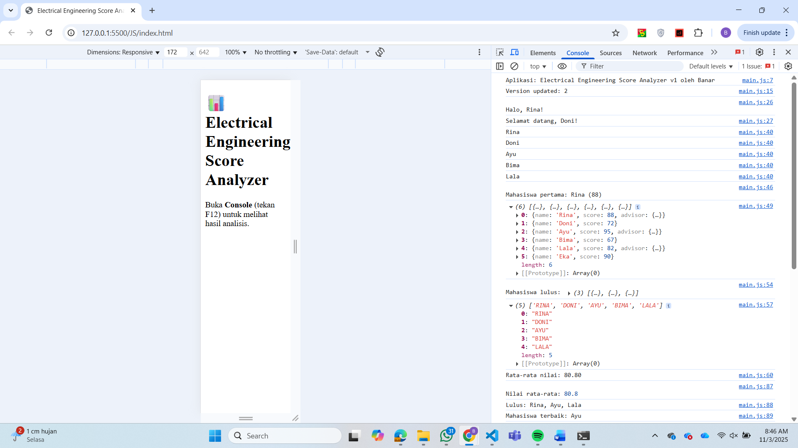
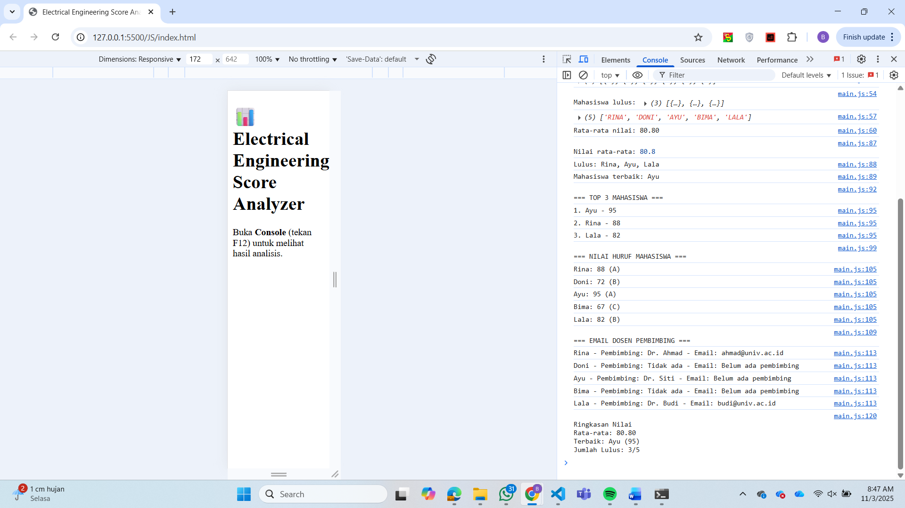
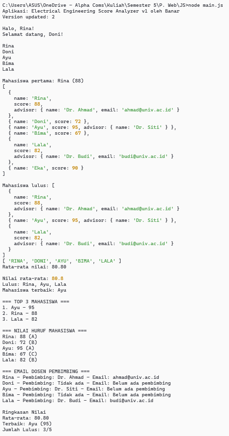

# 📊 Electrical Engineering Score Analyzer

[](https://www.javascript.com/)
[](LICENSE)
[]()

> Aplikasi web interaktif untuk menganalisis dan mengelola nilai mahasiswa Teknik Elektro dengan fitur ranking, konversi nilai huruf, dan sistem pembimbing akademik.

## 🎯 Fitur Utama

- ✅ **Manajemen Data Mahasiswa** - Pengelolaan data mahasiswa dengan skor dan pembimbing
- 📈 **Ranking Otomatis** - Peringkat mahasiswa berdasarkan skor tertinggi
- 🎓 **Konversi Nilai** - Konversi skor numerik ke nilai huruf (A-E)
- 📧 **Sistem Pembimbing** - Informasi dosen pembimbing dengan email
- 📊 **Statistik Real-time** - Rata-rata nilai, jumlah lulus, dan mahasiswa terbaik
- 🖥️ **Console Output** - Tampilan hasil analisis di browser console
- ⚡ **ES6+ Features** - Menggunakan destructuring, arrow functions, spread operator, optional chaining

## 📸 Screenshot Output

### 1️⃣ Output dari Browser Console (F12)



### 2️⃣ Output dari Terminal (node main.js)


## 📋 Prasyarat

- Browser modern (Chrome, Firefox, Edge, Safari)
- Node.js (opsional, untuk testing via terminal)

## 💻 Instalasi & Penggunaan

### 1️⃣ Clone Repository

```bash
git clone https://github.com/bnrpmbd/tugas-es6.git
cd tugas-es6
```

### 2️⃣ Jalankan di Browser

Buka file `index.html` di browser, lalu buka **Console** (tekan `F12` atau `Ctrl + Shift + J`):

```bash
# Windows
start index.html

# macOS
open index.html

# Linux
xdg-open index.html
```

Atau melalui Live Server di VSCode. 
**Lihat output di Console Browser**, bukan di halaman web.

### 3️⃣ Jalankan di Terminal (Node.js)

```bash
node main.js
```

## 📁 Struktur Project

```
Tugas 1/
├── index.html          # Halaman utama aplikasi
├── main.js             # Logic JavaScript & data processing
├── README.md           # Dokumentasi project
└── screenshots/        # Folder untuk screenshot output
    ├── console_1.png   # Screenshot console browser (part 1)
    ├── console_2.png   # Screenshot console browser (part 2)
    └── terminal.png    # Screenshot terminal output
```

## 🛠️ Teknologi yang Digunakan

- **JavaScript ES6+**
  - Arrow Functions
  - Destructuring
  - Spread Operator
  - Optional Chaining (`?.`)
  - Nullish Coalescing (`??`)
  - Template Literals
  - Array Methods (map, filter, reduce)

- **HTML5** - Minimal markup untuk load JavaScript
- **Console API** - Menampilkan output menggunakan `console.log()`

## 📚 Konsep JavaScript yang Diimplementasikan

### 1. Deklarasi Variabel (`const` vs `let`)

```javascript
const appName = "Electrical Engineering Score Analyzer";
let version = 1.0;
const author = "Banar";
```

### 2. Arrow Functions & Higher-Order Functions

```javascript
const getAverage = arr => arr.reduce((sum, s) => sum + s.score, 0) / arr.length;
const getPassed = arr => arr.filter(s => s.score >= 80);
```

### 3. Destructuring Parameters

```javascript
const getTopStudent = ([first, ...rest]) => {
  return rest.reduce((best, s) => s.score > best.score ? s : best, first);
};
```

### 4. Optional Chaining & Nullish Coalescing

```javascript
const email = student.advisor?.email ?? "Belum ada pembimbing";
```

### 5. Array Manipulation (Immutable)

```javascript
const rankStudents = (arr) => {
  return [...arr].sort((a, b) => b.score - a.score);
};
```

## 📊 Data Structure

```javascript
const students = [
  {
    name: "Rina",
    score: 88,
    advisor: {
      name: "Dr. Ahmad",
      email: "ahmad@univ.ac.id"
    }
  },
  // ...
];
```

## 🎓 Grading System

| Skor | Nilai Huruf |
|------|-------------|
| ≥ 85 | A |
| ≥ 70 | B |
| ≥ 60 | C |
| ≥ 50 | D |
| < 50 | E |

## 🔧 Kustomisasi

### Mengubah Data Mahasiswa

Edit array `students` di `main.js`:

```javascript
const students = [
  { name: "Nama Baru", score: 90, advisor: { name: "Dr. X", email: "x@univ.ac.id" } },
  // tambahkan mahasiswa lainnya...
];
```

### Mengubah Batas Kelulusan

Ubah kondisi di fungsi `getPassed`:

```javascript
const getPassed = arr => arr.filter(s => s.score >= 75); // ubah dari 80 ke 75
```

## 🐛 Troubleshooting

### Data tidak muncul di console browser?

1. Pastikan file `main.js` dan `index.html` di folder yang sama
2. Buka Console browser dengan menekan **F12** atau **Ctrl + Shift + J**
3. Hard refresh browser: `Ctrl + Shift + R` atau `Ctrl + F5`
4. Cek apakah ada error di Console

### Error "Identifier has already been declared"?

- Pastikan tidak ada variabel dengan nama yang sama
- Cek duplikasi `const` atau `let`

### Script tidak ter-load?

- Cek path di `<script src="main.js"></script>` sudah benar
- Pastikan nama file `main.js` (huruf kecil semua)

## 📈 Roadmap

- [ ] Tambahkan UI visual di halaman HTML (tidak hanya console)
- [ ] Export data ke PDF
- [ ] Import data dari CSV/Excel
- [ ] Database integration
- [ ] Authentication system
- [ ] Multi-semester support
- [ ] Grafik visualisasi nilai

## 🤝 Kontribusi

Kontribusi sangat diterima! Silakan:

1. Fork repository ini
2. Buat branch baru (`git checkout -b feature/AmazingFeature`)
3. Commit perubahan (`git commit -m 'Add some AmazingFeature'`)
4. Push ke branch (`git push origin feature/AmazingFeature`)
5. Buat Pull Request

## 📝 License

Distributed under the MIT License. See `LICENSE` for more information.

## 👨‍💻 Author

**Banar Pambudi**

- GitHub: [@bnrpmbd](https://github.com/bnrpmbd)
- Email: banarpambudi.ti@gmail.com
- LinkedIn: [@banarpambudi](linkedin.com/in/banarpambudi)

## 🙏 Acknowledgments

- Terima kasih kepada dosen pengampu mata kuliah Pemrograman Web
- Inspirasi dari berbagai tutorial JavaScript ES6+
- Community support dari Stack Overflow

---

⭐ **Star repository ini jika membantu!**

📫 **Punya pertanyaan?** Buat [issue](https://github.com/bnrpmbd/tugas-es6/issues) baru.

---

<p align="center">Made with ❤️ for Electrical Engineering Students</p>
